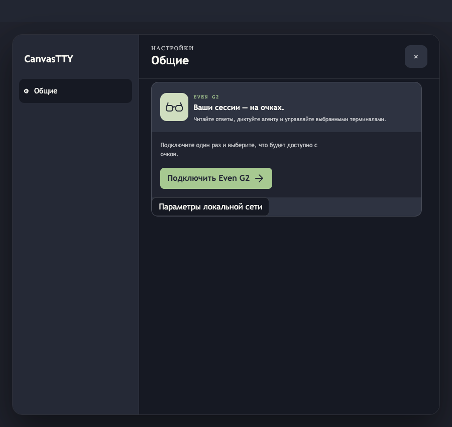
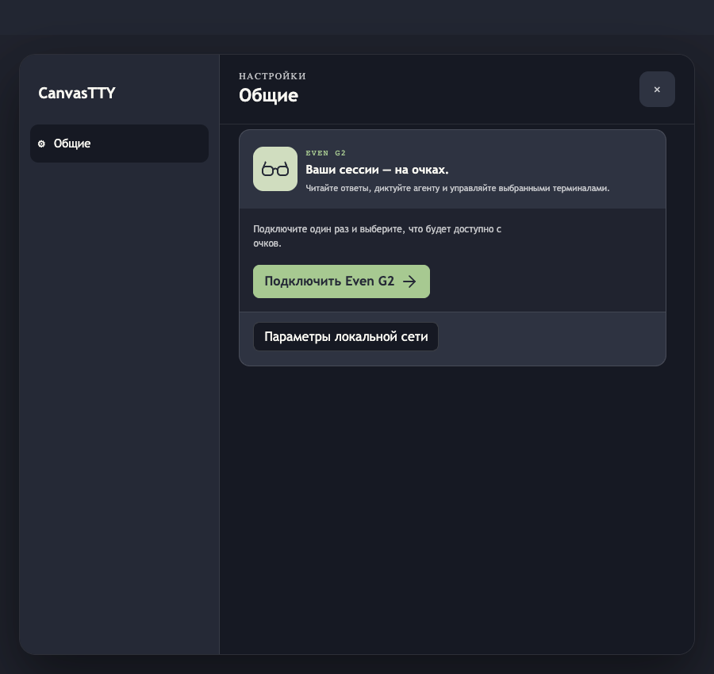
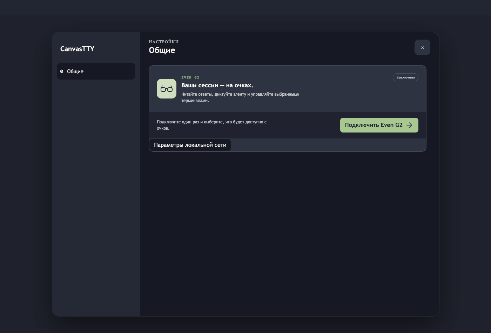
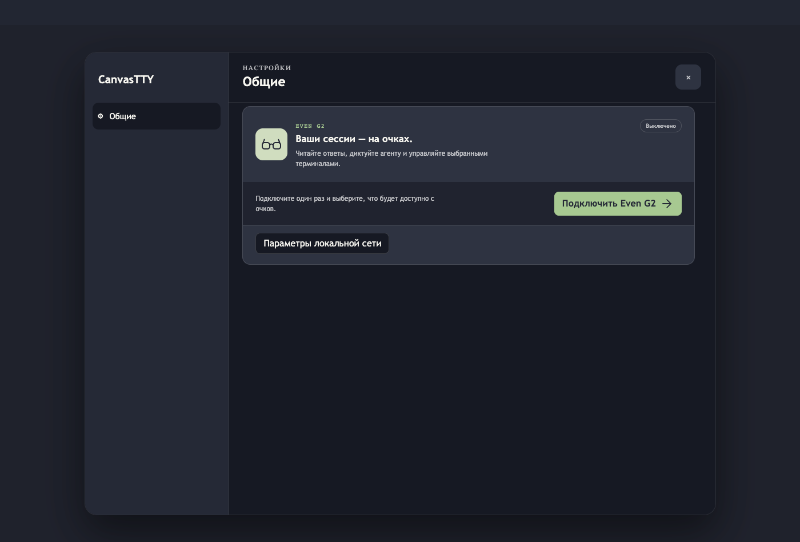

# Even G2 Settings layout

Before/after captures of the Even G2 Settings card after aligning its section insets and adding separation and bottom spacing around Local network settings.

The compact captures use a **900 × 850 px** viewport, which exercises the card's compact breakpoint. The wide captures use **1400 × 950 px**. All four use UI scale **1.25**, the maximum supported setting.

## Compact — 900 × 850, scale 1.25

| Before | After |
|---|---|
|  |  |

## Wide — 1400 × 950, scale 1.25

| Before | After |
|---|---|
|  |  |

## Preview and checks

These images come from an isolated Vite/headless Chrome preview that imports the actual `EvenG2Controls` component and repository styles inside a minimal Settings shell. The component receives a fixed synthetic, read-only state: Even G2 is disabled, there are no paired peers, and the local address list is empty. Its command stub returns the fixture unchanged.

Visually checked the shared section inset, the Local network settings divider and bottom breathing room, and compact/wide wrapping. The enabled peer and transport-control layouts were inspected separately with synthetic state during follow-up visual QA.

## Limits

This is component-level preview evidence, not a screenshot from an installed or live CanvasTTY app. It does not verify a real network, pairing, device transport, or physical Even G2. The four before/after images intentionally show the disabled overview state; enabled-state screenshots are retained separately in the worker preview. No real device identifiers, addresses, or secrets are included.
